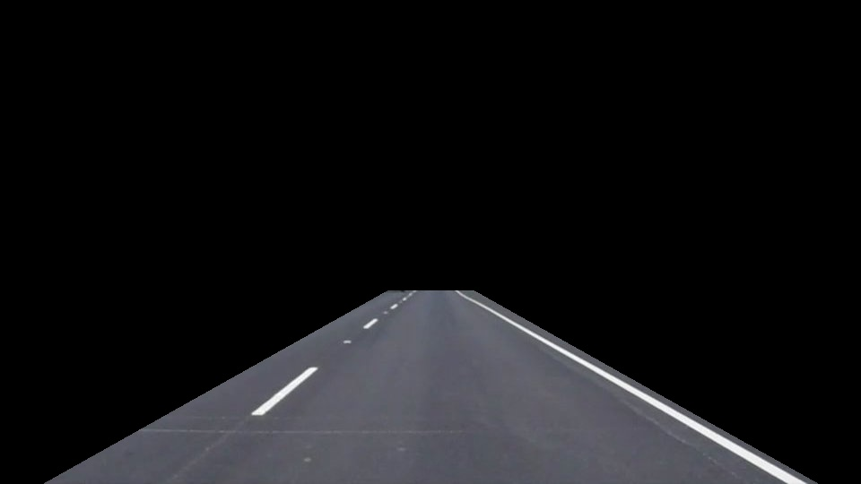

#**Finding Lane Lines on the Road** 

---

**Finding Lane Lines on the Road**

The goals / steps of this project are the following:
* Make a pipeline that finds lane lines on the road
* Reflect on your work in a written report

---

### Reflection

### My code is in P1.ipynb.  

### Sample images with extrapolated lane lines can be found in test_images/output. 

### white.mp4 is the output video for solidWhiteRight.mp4.  yellow.mp4 is the output for solidYellowLeft.mp4.  

### This repo contains all the input files so once you've cloned the repo, P1.ipynb should be runnable as-is.

###1. Describe your pipeline. As part of the description, explain how you modified the draw_lines() function.

My pipeline consisted of the following steps:

1.  Construct a filter that removed pixels that were not close in color to white or yellow.

2.  Convert the image to grayscale.

3.  Gaussian-blur the grayscale image with a kernel size of 5.

4.  Run Canny edge-detection on the blurred image, with low and high gradient thresholds of 50 and 150 respectively.

5.  Mask the region of interest on the Canny-edged image.  I did some trial and error to figure out a trapezoidal region of interest that masked out as much background clutter as possible.  This mask works for all the provided images, and both non-challenge videos.  Here's what it looks like applied to a raw image (although in the code, the mask is applied after the Canny stage, rather than to the raw image).

6.  I applied the Hough transform to the masked Canny-edged image.  Because I had restricted the region of interest aggressively to mask background clutter, I was able to get away with generous parameters parameters for the Hough line detection:  distance resolution 2, angular resolution pi/180, a threshold of 30 votes, a long min line length of 100, and a long max line gap of 200.  These generous parameters, in particular the long line gap, enabled striped lanes to be counted as part of the same Hough line segment in many cases.

7.  My draw_lines() was applied using the segments found by Hough transform.  It identified line segments as belonging to the left or right lanes using their raw x values (rather than their slopes).  This proved robust for the given data.  Then, it constructed an averaged left segment and an averaged right segment, using a length-weighted average of the Hough segments tagged for that particular side.  Finally, for the right and left averaged segments, their slope and one of their endpoints were used to linearly extrapolate them to the top and bottom of my trapezoidal region of interest.  

8.  I overlaid the averaged and extrapolated lines on the input image.

###2. Identify potential shortcomings with your current pipeline

1.  My pipeline relies on a tightly restricted region of interest based on trial and error with the given images.  The advantage of this approach is that it reduces environmental clutter, but the disadvantage is that the car must remain well-centered within the lane.  If the car begins to deviate from the lane, it must correct quickly, or else one lane line will disappear from the masked region and cease to be detected.

2.  If a white or yellow car cuts directly in front of my car and begins to occupy a large part of the region of interest, I expect we are screwed.  I assume that later in the course we will develop methods to recognize and respond to other cars.

3.  My scheme for separating yellow and white lane lines from the background road fails on the variably-lit road present in the challenge problem.  I need to figure out a better way to identify white and yellow pixels. 

###3. Suggest possible improvements to your pipeline

The tight-region-of-interest approach is not terrible, because that region of interest appears fairly consistent across samples, and should remain so as long as the car drives precisely.  It works for all the given input images and first two videos, but I may need to tweak it some more for the challenge video.

For now, my top priority is to figure out a better way to identify white and yellow pixels, especially on a variably-lit background.  Perhaps color information could be combined with some information from nearby pixels to tag pixels with "relatively" high yellowness or whiteness compared to the local background.

